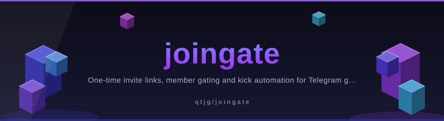
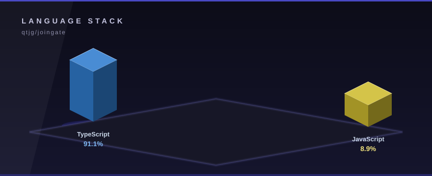

# joingate

<p align="center">
  
</p>


<!-- ⬡ 3D-UPGRADE v2 by Mayank Bhaskar -->
<div align="center">

**made by [Mayank Bhaskar](https://github.com/qtjg)** ·  

</div>

---
🩺 **New tool — `repo-pulse`**: instant git pulse (28-day heat bars, hot files, contributors). Run: `node tools/repo-pulse.mjs`

**One-time invite links, member gating and kick automation for Telegram groups & channels.**

[](https://github.com/qtjg/joingate/actions/workflows/ci.yml)
[](https://www.npmjs.com/package/joingate)
[](./LICENSE)
[](./src)

Built the hard way inside a production paid-membership SaaS: every function here handles the
ugly edges of Telegram's Bot API — leaked links, half-left members, rate limits, bots without
the right admin flags — so you don't rediscover them at 2 AM.

## Why

If you sell access to a Telegram group or channel, you need exactly four primitives:

1. **A link that dies after one join** — so a screenshot of it can't leak your community
2. **Proof your bot can actually gate the room** — admin + invite + ban rights, checked, not assumed
3. **A kick that's safe to re-run** — expired subscribers, idempotent cleanups
4. **DMs that fail softly** — half your users never pressed *Start* on your bot

That's the whole library. No update polling, no framework, no lock-in — pair it with
whatever bot framework you already use.

## Install

```bash
npm install joingate      # or: bun add joingate / pnpm add joingate
```

Zero dependencies. Runs on **Node 18+, Bun, Deno, Cloudflare Workers** — anything with `fetch`.

## Quickstart

```ts
import { JoinGate } from 'joingate'

const gate = new JoinGate(process.env.BOT_TOKEN!)
const CHAT = '@my_paid_community'

// 1. Fail fast if the bot can't actually gate the room
const perms = await gate.chatPermissions(CHAT)
if (!perms.canInvite) throw new Error('Make the bot an admin with "Invite Users via Link"')

// 2. The moment someone pays — mint a link that only works once, for 24h
const invite = await gate.createInvite(CHAT) // { link, expiresAt }
await gate.dm(payerUserId, `Welcome in! Your private link (works once): ${invite.link}`)

// 3. Subscription expired? Remove them, but leave the door open to return
await gate.kick(CHAT, payerUserId)
```

Prefer standalone functions? Every method is exported on its own:

```ts
import { verifyBot, createInvite, kickMember } from 'joingate'

await verifyBot(token)                          // → { id, username, name }
await createInvite(token, '-100123456789')      // → { link, expiresAt }
await kickMember(token, '-100123456789', 777)   // ban + instant unban
```

## API

| Function | Returns | Notes |
|---|---|---|
| `verifyBot(token)` | `{ id, username, name }` | `getMe` — proves the token is live |
| `chatPermissions(token, chatId)` | `{ isMember, isAdmin, canInvite, canKick }` | checks the **bot's own** membership & rights |
| `isMember(token, chatId, userId)` | `boolean` | is this user in the room right now |
| `chatTitle(token, chatId)` | `string \| null` | never throws |
| `createInvite(token, chatId, opts?)` | `{ link, expiresAt }` | defaults: `memberLimit: 1`, `ttlHours: 24` |
| `kickMember(token, chatId, userId)` | `void` | ban + unban; "already gone" resolves as success |
| `dmUser(token, userId, html)` | `'ok' \| 'rejected' \| 'unknown'` | never throws |
| `tgCall<T>(token, method, payload?)` | `T` | typed escape hatch to any Bot API method |

`chatId` accepts `@publicchannel` usernames or `-100…` numeric IDs.
Every function takes a final `CallOptions` object: `{ timeoutMs, retries, fetchImpl, apiUrl }`.

### The `JoinGate` class

Binds your token once and mirrors the whole API as methods, plus `.raw<T>(method, payload)`
for anything not wrapped above.

## Errors that behave

`TelegramError` carries `method`, `description`, `code`, plus two properties that encode
hard-won Telegram wisdom:

```ts
try {
  await gate.kick(CHAT, userId)
} catch (err) {
  if (err instanceof TelegramError) {
    err.benign        // true = goal already achieved (user already left) — safe to ignore
    err.rateLimited   // true = 429; joingate already retried respecting retry_after
    err.retryAfterSeconds
  }
}
```

429s are retried automatically (up to `retries: 2` by default, honoring Telegram's
`retry_after`), so a burst of renewals doesn't take your fulfillment job down.

## Paid-community recipe

```ts
// on payment webhook
const invite = await gate.createInvite(CHAT, { memberLimit: 1, ttlHours: 24, name: `order_${orderId}` })
await db.save(orderId, invite.link, invite.expiresAt)
const dm = await gate.dm(userId, `Thanks! Your one-time link: ${invite.link}`)
if (dm === 'rejected') {
  // user never started the bot — fall back to showing the link on your success page
}

// nightly cron: expired subscribers out, re-joiners welcome back
for (const sub of await db.expired()) {
  await gate.kick(CHAT, sub.telegramUserId)   // idempotent — safe to re-run
}
```

## Self-hosted Bot API server

```ts
const gate = new JoinGate(token, { apiUrl: 'http://tg-local:8081' })
```

## Development

```bash
bun install
bun test          # 24 tests, mock fetch — never touches the real API
bun run build     # ESM + CJS dual build with declarations
```

PRs welcome — please add a test for any behavior change.


---

## 🧊 3D Visuals

<p align="center">
  
</p>

Isometric 3D language stack computed from live GitHub language stats.
Regenerate the graphics any time with the built-in generator — stdlib only, zero dependencies:

```bash
python tools/generate_3d_assets.py
```

## License

[MIT](./LICENSE)